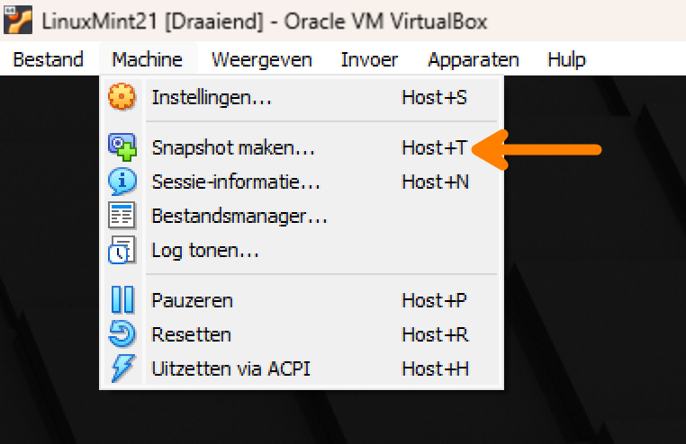

# First Linux VM

## Installatie

- [ ] Zorg eerst dat je een lokale kopie hebt van je Git repository zodat je je labo-nota's kunt bijhouden.

    Zie [de instructies voor Git](../../info/git-instructies.md) voor meer details.

- [ ] Installeer VirtualBox, of upgrade naar de laatste stabiele versie (of de versie die aangeraden wordt door de lectoren). Installeer ook de VirtualBox Extension Pack. Instructies vind je in de Orion-cursus.

- [ ] Download de Linux-VM via de link in de cursus op Orion en importeer deze in VirtualBox.

- [ ] Start de VM op en zorg dat je kan inloggen. Ga op verkenning en kijk of je volgende programma's kan opstarten:

    - Webbrowser
    - Bestandsbeheer
    - Terminal
    - Teksteditor
    - Instellingen

- [ ] Het is nuttig om er voor te zorgen dat je in je VM in de webbrowser inlogt op Orion, zodat je van daaruit makkelijk toegang hebt tot de cursusmaterialen en het forum. Log voor dezelfde reden ook in op Github. Gebruik de wachtwoordmanager op je VM om je wachtwoorden op te slaan.

## Basisinstellingen

Meestal zal je een pas geïnstalleerd systeem nog configureren naar je wensen. Ook op deze VM is het nuttig enkele aanpassingen te doen:

- [ ] Standaard is de US-qwerty **toetsenbordindeling** geselecteerd. Als je zelf een azerty-toetsenbord hebt, zorg je er voor dat deze ingesteld is.

- [ ] De VM heeft een screensaver die na enkele minuten inactiviteit je scherm blokkeert zodat je opnieuw je wachtwoord moet geven. Voor een VM is dat zinloos, dus schakel de screensaver (en screen lock) uit.

- [ ] In het VirtualBox-venster waarbinnen de VM draait, open je het menu "Apparaten". Controleer of "Gedeeld klembord" ingesteld staat op "Bidirectioneel". Hiermee kan je tekst kopiëren tussen je fysieke systeem en je VM (en omgekeerd)

- [ ] Start Firefox en log in op Chamilo en Github. Creëer een bookmark naar de Chamilo-cursus voor dit vak en naar je Github-repository voor de labo's. Dit komt later zeker nog van pas!

- [ ] Maak een SSH-sleutelpaar aan met het commando `ssh-keygen` [volgens de instructies](../../info/git-instructies.md) en voeg die toe aan je Github-account.

## Een snapshot nemen

Op dit moment is je VM goed geconfigureerd en heb je de meeste applicaties die je nodig zal hebben geïnstalleerd. Het is nu een goed moment om een backup te nemen waar je later op terug kan vallen als je door te experimenteren je VM onbruikbaar gemaakt hebt. Dat kan door in het venster waarbinnen de VM draait "Machine > Snapshot maken" te kiezen. Je geeft de snapshot een naam (bv. "Na installatie"). Dat kan terwijl de VM draait!

## De VM uitzetten

Let op bij het **uitschakelen van de VM**: doe dit **NOOIT** door het VirtualBox-venster waarbinnen de VM draait af te sluiten met de knop rechtsboven en dan "De machine uitschakelen". Dit komt overeen met de stroom onderbreken op een fysiek toestel en kan leiden tot corrupte bestanden, bijvoorbeeld wanneer een schrijfoperatie nog in een geheugenbuffer staat en niet is voltooid.

Sluit in plaats daarvan af met een van de volgende methoden:

- Kies voor "De staat van de machine opslaan". Als je de volgende keer de VM aanzet, ben je meteen ingelogd en kan je verder waar je de vorige keer gebleven was.
- Open in de grafische omgeving van je VM het startmenu en kies voor de optie om het systeem uit te schakelen.
- Open een terminal in je VM en gebruik het commando `sudo poweroff` om het systeem netjes af te sluiten.
