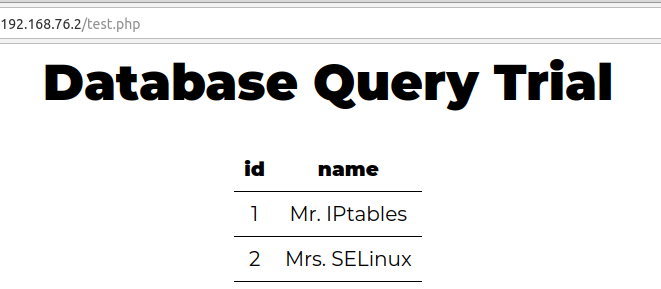

# Labo Webserver Hardening

In dit labo gaan we de database opvullen met wat demo-data, zodat een webapplicatie er gebruik kan van maken. We gaan daarnaast enkele hardening-technieken toepassen op de server-VM, zodat deze beter beveiligd is tegen aanvallen van buitenaf.

## MySQL/MariaDB

Als eerste stap beperken we de ruimte voor de mysql server: we perken het IP adres in, en veranderen het poortnummer.

### MariaDB IP-adres veranderen

1. Waar vind je op de server-VM de configuratie van MariaDB terug? Maak een backup van het/de configuratiebestand door(en) die je aanpast door het te kopiëren (bv. door een extensie .bak toe te voegen) voordat je start met het bewerken!

2. Ga de status van de MariaDB server na met `systemctl`. Verifiëer het IP-adres en poortnummer van de service met `ss`.

3. Open het configuratiebestand. Plaats bij de sectie `[server]` in het bestand een variabele `bind-address`, en zet de waarde op het "intnet" IP-adres van je server. Herstart de service, en verifiëer met `ss` dat de mariadb service enkel nog actief is op dit IP-adres.

4. Installeer de package `netcat`. Maak een test-verbinding met de mariadb server: `nc -nvz [IP-adres] 3306`. Test dit eveneens met de twee andere IP-adressen van je server (NAT, localhost). Verifiëer dat dit niet langer werkt!

### MariaDB poortnummer veranderen

1. 3306 is een te publiek gekende poort en trekt gemakkelijk online de aandacht van hackers. Laten we een alternatieve poort zoeken: welk poortnummer vind je in `/etc/services` terug voor het niet langer gebruikte UniSQL protocol? Noteer.

2. Bewerkt opnieuw het serverconfiguratiebestand, en plaats een waarde port onder het IP-adres van hierboven. Stel op deze manier het poortnummer in op dit van UniSQL. Herstart de `mariadb`-service.

3. Normaal zal je `mariadb`-server niet willen opstarten! SELinux laat immers slechts een beperkt aantal poorten toe voor MariaDB. Ga op [in de MariaDB-documentatie](https://mariadb.com/docs/server/security/securing-mariadb/selinux) na hoe je toelaat dat de `mariadb`-service het hierboven gekozen poortnummer mag gebruiken. Herstart nu nogmaals je `mariadb`-service - tot hij werkt!

4. Test de aanpassing met `nc -nvz [IP-adres] [nieuw poortnummer]`.

### MariaDB directory veranderen

1. Standaard bewaart de DB server zijn data in de map `/var/lib/mysql`. Maak een map `/dbdata` aan op je server. Verander de eigenaar en de groep van deze map naar `mysql:mysql` - het is deze gebruiker die operaties uitvoert op de map als de service zaken verandert!

2. Wijzig in het configuratiebestand de locatie voor de database data naar deze map.

3. Herstart de `mariadb` service. Als alles goed gaat, zal je mariadb server niet opstarten! Opnieuw gaan we ook SELinux nog moeten aanpassen opdat deze map gebruikt mag worden. Gebruik opnieuw de MariaDB-documentatie (zie link hierboven) om na te gaan hoe je dit moet configureren. Herstart nu nogmaals je mariadb service - tot hij werkt.

### Database opvullen

Nu we een werkende database server hebben (weliswaar op een ingeperkt IP, een andere poort en een niet conventionele map), kunnen we de database ook initialiseren en er een set data aan voeden:

1. Gebruik de `mysql`-client om in te loggen op je database server. Als je dit met `sudo` doet, heb je ook admin-privileges op de hele database.

2. Maak een gebruiker aan die toegang krijgt tot een nieuwe database:

    ```sql
    CREATE DATABASE IF NOT EXISTS trialsite;
    GRANT ALL ON trialsite.* TO 'www_user'@'%' identified by 'YourSitePassword';
    FLUSH PRIVILEGES;
    ```

3. Voer met deze nieuwe gebruiker een set van data in in jouw database:

    ```console
    $ mysql --user="www_user" --password="YourSitePassword" "trialsite" << _EOF_
    DROP TABLE IF EXISTS trialsite_tbl;
    CREATE TABLE trialsite_tbl (
    id int(5) NOT NULL AUTO_INCREMENT,
    name varchar(50) DEFAULT NULL,
    PRIMARY KEY(id)
    );
    INSERT INTO trialsite_tbl (name) VALUES ("Mr. IPtables");
    INSERT INTO trialsite_tbl (name) VALUES ("Mrs. SELinux");
    _EOF_
    ```

4. Test je gecreëerde database met het volgende bash script `test_db.sh`. Je kan dit zelf aanmaken op je server-VM:

    ```bash
    #!/bin/bash
    test_database='trialsite'
    test_table='trialsite_tbl'
    test_user='www_user'
    test_password='YourSitePassword'
    db_host='JUISTE IP INVULLEN'
    db_port='JUISTE POORT INVULLEN'

    mysql --host="${db_host}" --port="${db_port}" \
        --user="${test_user}" \
        --password="${test_password}" \
        "${test_database}" \
        --execute="SELECT * FROM ${test_table};"
    ```

5. Als je succesvol test, is je screen output het volgende:

    ```text
    +----+----------------+
    | id | name           |
    +----+----------------+
    |  1 | Mr. IPtables   |
    |  2 | Mrs. SELinux   |
    +----+----------------+
    ```

## Webserver hardening

In dit vervolg zetten we enerzijds een php pagina op die kan verbinden met de database server; anderzijds gaan we aan de slag met het commando `firewall-cmd`.

### Testen basisopstelling

- Surf vanop je Linux GUI-VM naar het IP-adres van jouw webserver. Als dit niet werkt, wat zou de oorzaak kunnen zijn?

- Pas de firewall op de server aan opdat deze verbinding wel kan tot stand komen. Zorg dat zowel http als https werken!

### PHP-script installeren

1. Installeer de package `php-mysqlnd` op je server-VM. Deze laat toe om vanuit een PHP-script te communiceren met een MySQL(-compatibele) database.

2. Ga naar jouw home folder. Creëer hier het bestand `test.php` met de inhoud zoals het codeblok hieronder.

3. Verplaats vervolgens (met `mv`) dit bestand naar de *DocumentRoot*-folder. Kan je de pagina zien in de browser? Zoniet, welke foutboodschap krijg je? Kijk naar de bestandspermissies van alle files in de *DocumentRoot*-folder. Kan je, door de de eigenaar en bestandspermissies aan te passen, de pagina wél te zien krijgen? Merk op dat de permissies op "777" **GEEN** oplossing is. Wat zouden correcte permissies en eigenaar moeten zijn voor webpagina's of scripts?

4. Controleer nu ook de SELinux-context van de bestanden in de *DocumentRoot*-folder (`ls -Z`). Welke context zie je en wat zou de correcte context moeten zijn?

    Zorg er voor dat alle bestanden in de *DocumentRoot*-folder de correcte SELinux-context krijgen. Er zijn verschillende manieren om dit te doen! Kijk zeker eens in de (uitstekende!) RedHat Manual [Using SELinux](https://docs.redhat.com/en/documentation/red_hat_enterprise_linux/10/html/using_selinux/troubleshooting-problems-related-to-selinux#fixing-analyzed-selinux-denials).

    Als je succesvol bent, zal de PHP pagina correct inladen - maar wel (nog) geen connectie kunnen maken met de database server! Welke foutmelding krijg je?

Dit is de broncode van het PHP-script:

```php
<html>
<head>
<title>Demo</title>
<link href="https://fonts.googleapis.com/css2?family=Montserrat:wght@400;900&display=swap" rel="stylesheet">
<style>
table, th, td {
 border-bottom: 1px solid black;
 padding: 10px;
 border-collapse: collapse;
 text-align: center;
}
.center {
 margin-left: auto;
 margin-right: auto;
}
h1 {
 text-align: center;
 font-size: 50px;
}
* {
 font-family: Montserrat;
 font-size: 20px;
     
}
</style>
</head>
<body>
<h1>Database Query Demo</h1>

<?php
// Variables
$db_host='192.168.76.3';
$db_user='www_user';
$db_name='trialsite';
$db_password='Kof3Cup.ByRu';
$db_table='trialsite_tbl';

// Connecting, selecting database
$connection = new mysqli($db_host, $db_user, $db_password, $db_name);

if ($connection->connect_error) {
               die("<p>Could not connect to database server:</p>" . $connection->connect_error);
}

// Performing SQL query
$query = "SELECT * FROM $db_table";
$result = $connection->query($query);

// Printing results in HTML
echo "<table class=\"center\">\n\t<tr><th>id</th><th>name</th></tr>\n";
while ($row = $result->fetch_assoc()) {
           echo "\t<tr>\n";
               echo "\t\t<td>" . $row["id"] . "</td>\n";
               echo "\t\t<td>" . $row["name"] . "</td>\n";
                   echo "\t</tr>\n";
}
echo "</table>\n";

$result->close();

$connection->close();
?>
</body>
</html>
```

### Database-connectie toestaan

We kunnen bij connectieproblemen verleid worden tot zoeken naar problemen bij de firewall. Maar, omdat de database-service op dezelfde VM geïnstalleerd is als Apache, verlopen de verbindingen van het ene proces naar het andere niet via het externe netwerk, maar over de loopback-interface. Wie het verkeer monitort met e.g. Wireshark of `tcpdump` (zie het vak "CyberSecurity & Virtualisation"), zou dit kunnen aantonen. Dit valt echter buiten de scope van deze Linux-cursus.

Long story short: Het is in dit geval SELinux die niet toelaat dat Apache zomaar een netwerkverbinding met een database-server mag initialiseren. Om dit toch toe te laten, moet je een SELinux boolean instellen. De stappen hiervoor vind je eveneens terug in de manual [Using SELinux](https://docs.redhat.com/en/documentation/red_hat_enterprise_linux/10/html/using_selinux/troubleshooting-problems-related-to-selinux#fixing-analyzed-selinux-denials).

Het eindresultaat moet er zo uitzien:


