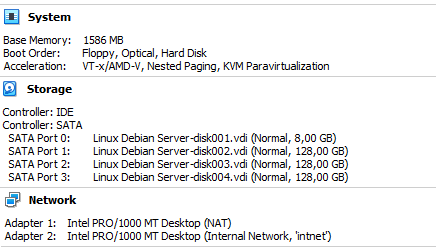
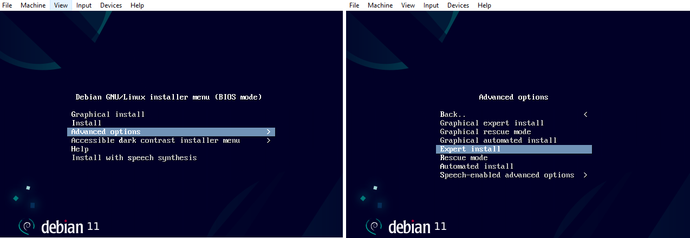
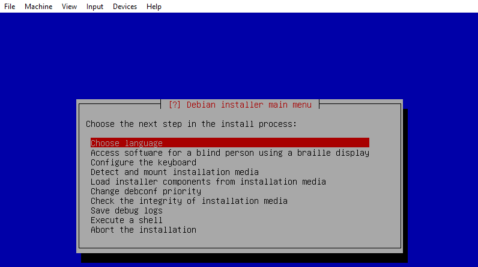
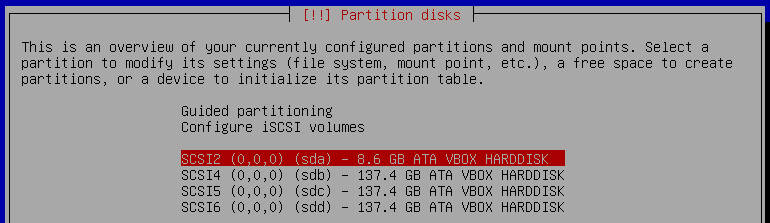
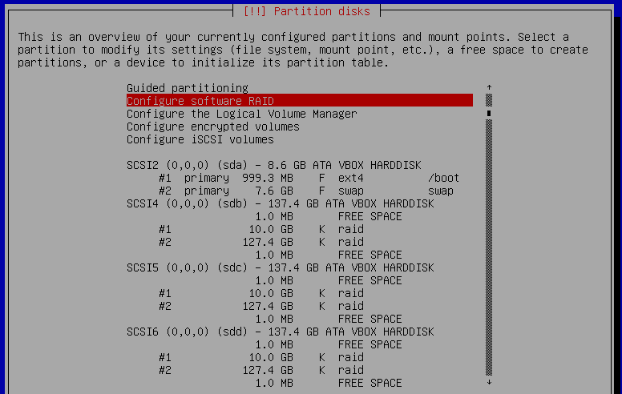
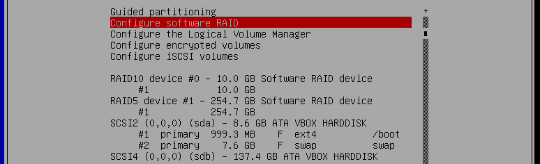

# Labo Expert Install met RAID disks

In deze oefening zetten we een Debian-based server op, gebaseerd op de Expert Install. We starten vanaf een geconfigureerde, maar nog niet geïnstalleerde VirtualBox-VM.

*Hoe bereidt een infrastructure engineer een serveromgeving voor?* is de vraag die we ons nu stellen. In de praktijk zijn er twee gangbare scenario's:

- **Golden Image**: een volledig geïnstalleerde en geconfigureerde server waarvan je achteraf een disk image neemt om te kopiëren naar nieuwe systemen. Je Linux GUI-VM is hier een voorbeeld van. Deze is gebaseerd op een kant-en-klare image die we van van <https://osboxes.org> gehaald hebben (en nog een klein beetje aangepast hebben voor onze doeleinden).

- **JEOS + scripts**: een basis-image met *Just Enough Operating System* (JEOS), met een minimale installatie en een admin-gebruiker om in te loggen via SSH. Deze configureer je verder met een script of een configuration management system. Je Vagrant-VMs met je provisioning-scripts zijn hier een voorbeeld van.

Een *manuele installatie* waarbij je stap voor stap een server installeert en configureert, is in de praktijk niet meer zo gangbaar. Nochtans is het nuttig, en voor een it infrastructure engineer zelfs noodzakelijk, om te weten hoe zo'n installatie in zijn werk gaat. Je moet immers kunnen inschatten welke stappen er nodig zijn, en welke keuzes er gemaakt moeten worden.

Het installeren van Linux is, voor een GUI systeem, trouwens kinderspel geworden: enkele muisklikken over welke taal en welke tijdzone je wil, en je (virtuele) computer wordt geformateerd en voorzien van Linux.

De *expert install*, die gebruikt wordt voor bv. servers, biedt ons een gedetailleerd overzicht van elke stap die genomen wordt in het opbouwen van een Linux OS. Stappen als kiezen hoe de harde schijf wordt ingedeeld, welke applicaties of applicatiegroepen geïnstalleerd moeten worden, ...

Ook het opzetten van zo'n basissysteem zou volledig geautomatiseerd kunnen worden: de keuzes die je tijdens de installatie wenst te maken, worden dan in een configuratiebestand gegoten, dat door de installer ingelezen en toegepast wordt! Op Enterprise Linux gebruiken we hiervoor [Kickstart](https://docs.redhat.com/en/documentation/red_hat_enterprise_linux/10/html/automatically_installing_rhel/creating-kickstart-files); Debian based systemen kunnen uitgerold worden met Fully [Automatic Installation (FAI)](https://fai-project.org). Tools zoals [Packer](https://www.packer.io) kunnen je helpen om ook het aanmaken van de VM in combinatie met Kickstart of FAI volledig te automatiseren en reproduceerbaar te maken. Het kunnen opzetten van deze systemen valt buiten de scope van deze cursus, maar de idee dat ze bestaan geven we toch graag mee!

## Specificaties

Enkele specificaties van deze VM:

- 64bits CPU, AMD64 architectuur
- 1.5GB RAM
- 2 NICs: NAT, intnet
- 4 HDs: 8GB, 3x128GB

Een server heeft soms een flash-card voor het OS en SSD's (of klassieke harde schijven) voor data. Dit scenario bouwen we hier na. De drie grote schijven gaan we opdelen in partities, die ook als (software) RAID gaan geconfigureerd worden.

Ons doel is om voor zowel de map `/var/www/html` als voor de map `/` een RAID op te zetten. De kernel in `/boot` komt terecht op een aparte (niet redundante) partitie.

## Voorbereiding

1. Voor dit labo heb je volgende bestanden nodig. Download deze eerst:

    - Het .ova-bestand met de eigenschappen van de VM. TODO: LINK TOEVOEGEN
    - De netinst-ISO van de laatste Debian-release voor jouw CPU-architectuur (amd64 of arm64). Deze kan je downloaden vanop <https://www.debian.org/CD/netinst/>

2. Bij het opstarten van deze nieuwe VM merk je dat het systeem niet kan booten. Er is immers nog geen OS!

    Voeg via *Devices > Optical Drives* de netinst-ISO toe aan de VM. Dit is het equivalent van een CD-rom plaatsen in het CD-station van een fysieke computer. Herstart de VM.

3. Kies in het CD start menu *Advanced options*, gevolgd door *Expert install*.

    

4. Je komt terecht in het (TUI) *Debian installer main menu*. Hierna kan je starten aan de *Expert Install*.

    

## Expert Install - basisstappen

Bij het doorlopen van de opeenvolgende stappen van deze installatie, volg je de volgende richtlijnen op:

- Choose language: English, location Belgium, locale `en_US.UTF-8`
- Braille: sla dit over
- Keyboard: keuze tussen American English (qwerty) of Belgian (azerty), naar gelang jouw voorkeur
- Detect install media: druk ENTER. Je merkt dat je install CD-rom wordt gedetecteerd
- Load installer components:
    - Kies 'fdisk-udeb' -> je kan partities bewerken
    - Kies 'parted-udeb' -> je kan partities bewerken
    - Ga verder. Deze nieuwe opties worden geactiveerd en aan het menu toegevoegd.
- Detect Network hardware: gewoon uitvoeren
- Configure Network:
    - enp0s3: primary interface - NAT interface, dus deze laten we automatisch (met DHCP) configureren
    - hostname: debserv; domain name: linux.lan
- Set up users:
    - enable shadow passwords, dissallow root login
    - je bent nu verplicht om een eerste gebruiker aan te maken, die via sudo root-rechten kan krijgen. User: boss; passwd: boss
- Configure clock: NTP (ntp.belnet.be); Europe/Brussels
- Detect disks - laat alle harde schijven detecteren

## Expert Install - partities en RAID

De volgende stap, Partition disks, vergt even onze aandacht. We gaan namelijk handmatig onze RAID configureren, voor we verder gaan. De methode die we kiezen is dus *Manual*

Selecteer de eerste harde schijf (sda):

- create new partition table, type msdos
- create new partition, kies als grootte 1 GB (primary)
    - Use as Ext4
    - Mount point veranderen we naar /boot
    - Bootable flag 'on' -> dit wordt de partitie die eerst opstart, met de kernel er op (zie verder)
- selecteer de 'FREE SPACE' die je nog hebt op deze schijf.
    - kies als grootte de rest van de schijf (7.6 GB) (terug primary)
    - Use as 'swap area'
- Done setting up these partitions

Kies nu de tweede harde schijf (sdb):

- create new partition table, type gpt
- create new partition, kies als grootte 10 GB
    - bij 'Use as' verander je de 'Ext4' suggestie: kies hier - 'physical volume for RAID'
    - Done setting up the partition
- selecteer de 'FREE SPACE' die je nog hebt op deze - schijf.
    - kies als grootte de rest van de schijf (127.4 GB)
    - ook hier kies je 'physical volume for RAID'

Herhaal dezelfde stappen voor de 3e en 4e schijf (sdc en sdd). Ze zijn immers identiek in afmetingen.

Als alles goed geconfigureerd is, krijg je de volgende indeling:

Met deze partities kan je verder gaan om de software RAID te configureren:

- First RAID (voor `/`):
    - Create MD device, choose RAID10
    - 2 active devices, 1 spare
    - kies sdb1, sdc1 als active en sdd1 als spare (alle 3 10GB) voor deze RAID
    - de layout laat je op de default 'n2'
- Second RAID (voor /var/www/html):
    - Create MD device, choose RAID5
    - 3 active devices (no spare)
    - kies sdb2, sdc2 en sdd2 (alle 3 +/-127GB) voor deze RAID

Na 'Finish' krijg je deze indeling te zien op jouw partities:

Vervolgens stel je deze nieuwe RAID devices in als te mounten partities voor jouw verdere installatie:

- RAID10 device #0 wordt de partitie `/`, geformateerd met ext4
- RAID5 device #1 wordt de partitie `/var/www/html`, ook geformateerd met ext4
    - verminder hier het percentage reserved blocks naar 2%

## Expert Install - base system

- install the base system: deze stap kopieert de basis debian packages van de CD-rom, en brengt voor het eerst Linux software aan op jouw partities.

    Deze stap duurt wel even.

    - kernel: linux-image-amd64 (jawel, dit is het effectieve OS)
    - generic drivers

- Package manager - apt:
    - extra media: no - er is geen tweede CD-rom
    - mirror: http -> ftp.be.debian.org. Dit wordt de primaire repository server van jouw server
        - geen proxy
        - use non-free software
        - security en release updates zijn relevant
- Select software:
    - Kies geen grafische omgeving: schakel GNOME uit (want te groot en te zwaar), alsook 'Debian desktop environment'

        Een "lichte" GUI zou Xfce of LXDE zijn, ook MATE is minder zwaar. Een server heeft in lijn geen GUI inlog omgeving - dus selecteren we er geen!

    - enable zowel de web- als de SSH-server
    - een heleboel packages (100 à 200) worden nu gedownload, en geïnstalleerd.

- Install GRUB: de bootloader legt de link tussen het opstarten van de BIOS, en de partitie waarop je het OS installeert (`/boot`, met daar het bestand `vmlinuz`, de kernel)

    - kies `/dev/sda` om de bootloader op te installeren

- Finish the installation.

Eens de CD-rom verwijderd is, zal je computer herstarten. Kies in GRUB je kernel, en start je server op.

## Reflectievragen

Log in op het nieuwe systeem.

- Hoeveel ruimte biedt jouw 1e RAID (raid10)? Bekijk de vrije schijfruimte met `df -h`. Komt dit overeen met de grootte van de partities?

- Verifieer deze RAID met `mdadm`. Vergelijk de 'Array Size' met de 'Used Dev Size'.

- Doe hetzelfde voor je 2e RAID (raid5)
