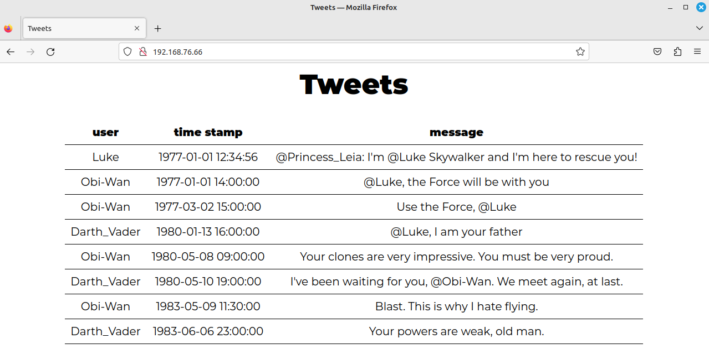

# Labo Troubleshooting

## Vagrant demo-opstelling klassikale instructie

De Vagrant-omgeving in deze directory werd ook gebruikt in de demo tijdens de les. Je kan deze gebruiken om zelf te oefenen met troubleshooting. Als je tijdens de demo meegevolgd hebt en dus wijzigingen hebt aangebracht, verwijder je de opstelling met `vagrant destroy` en begin je opnieuw met `vagrant up`.

Ga systematisch en grondig te werk en maak een verslag van je werkwijze. Gebruik meer bepaald de **bottom-up strategie** en benoem duidelijk de verschillende fasen. Geef binnen elke fase aan welk aspect je test, de waarde die je verwacht en deze die je effectief verkrijgt, het exacte commando dat je gebruikt hebt om dit na te gaan en wat je precies gedaan hebt om een eventuele fout op te lossen (= exacte commando's en/of wijzigingen in configuratiebestanden). Wees gedetailleerd en beschrijf ook het eindresultaat a.h.v. screenshots. Toon in het bijzonder aan dat je de website kan zien vanop je Linux GUI-VM!

## Extra troubleshooting-oefening

TODO: link invoegen

In deze labo-opdracht krijg je een virtuele machine met een LAMP-stack (AlmaLinux, Apache, MariaDB, PHP). Er zitten echter fouten in de configuratie van de VM waardoor de webserver niet werkt. De bedoeling is dus om alle fouten op te sporen en op te lossen zodat je website te zien krijgt zoals in de afbeelding hieronder.



Pas opnieuw op een systematische en grondige manier de bottom-up strategie toe en maak een verslag van je werkwijze, net zoals hierboven beschreven.

Na het opstarten van de VM kan je inloggen met gebruiker `vagrant` en wachtwoord `vagrant`. Deze gebruiker heeft `sudo`-rechten. Tip: log in met `ssh` vanop je fysieke systeem zodat je makkelijk tekst kan kopiëren en plakken naar je labo-verslag en zodat je geen last hebt van de toetsenbordinstellingen van de VM.


In  de  directory `/usr/local/bin` is  een commando `acceptance-tests` geïnstalleerd dat enkele acceptatietests uitvoert. Je kan het uitvoeren om te controleren hoe ver je staat, maar kijk ook verder dan de uitvoer van de tests! Dat alle acceptatietests slagen betekent bijvoorbeeld niet noodzakelijk dat de website correct getoond wordt vanaf de Linux GUI-VM.

```console
[vagrant@fixme ~]$ acceptance-tests
acceptance-tests
 ✓ SELinux shoud be enforcing
 ✓ The firewall should be running
 ✓ I should have the correct IP address
 ✓ The Apache service should be running
 ✓ The correct website should be served
5 tests, 0 failures
```

Requirements:

- Het IP-adres van de VM moet 192.168.76.9 zijn.
- Alle acceptatietests moeten slagen. Er wordt o.a. gecontroleerd of SELinux geactiveerd is, of de firewall aan staat en of de juiste webpagina getoond wordt.
- De  website moet te zien zijn vanop de Linux GUI-VM door <http://192.168.76.9/> in een webbrowser in te geven (https is in deze opstelling niet geactiveerd).
