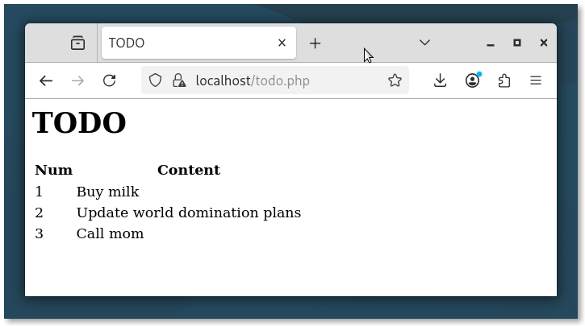

# Labo Webserver

In dit labo zullen we een webserver opzetten in je Linux-VM. Eén van de redenen waarom Linux zo'n dominante positie heeft verworven in het datacenter is doordat het werd ingezet als een platform voor webapplicaties, meer bepaald in de vorm van de zgn. LAMP-stack. Deze afkorting staat voor Linux + Apache + MySQL + PHP. De combinatie vormt een platform voor het ontwikkelen van webapplicaties waar vele bekende websites (bv. Facebook) op gebaseerd zijn.

Beschrijf telkens zo precies mogelijk de procedure die je gevolgd hebt. Zorg er voor dat je aan de hand van je beschrijving deze taken later heel vlot kan herhalen als dat nodig is. Een goede procedurehandleiding is een eerste stap in het automatiseren van de installatie. Test ook telkens na elke stap dat die correct verlopen is.

## Apache installeren

- Installeer Apache op je virtuele machine en verifieer dat hij draait en bereikbaar is vanuit een webbrowser in de VM.

- Installeer ondersteuning voor HTTPS en verifieer dat dit werkt, bijvoorbeeld met curl of een webbrowser.

    Verklaar de foutmeldingen die je krijgt als je dit probeert en zoek uit hoe je deze kan omzeilen. We gebruiken bewust het woord *omzeilen*, want je zal het niet kunnen *oplossen*. Kan je uitleggen waarom dat is?

- Installeer ondersteuning voor PHP en verifieer dat dit werkt, bijvoorbeeld met een eenvoudige PHP-pagina (bv. `<?php phpinfo; ?>`).

## MariaDB installeren

MariaDB is de naam van een variant (fork) van de bekende database MySQL. Op sommige Linux-distributies (zoals Fedora) is MySQL zelfs niet meer beschikbaar. MariaDB is wel grotendeels compatibel en kan perfect dienen als vervanger. Installeer MariaDB op je virtuele machine.

Hieronder vind je een SQL-script waarmee je een database kan aanmaken met wat demo-info. Je kan het opslaan in een bestand en met het `mysql`-commando uitvoeren.

```sql
DROP DATABASE IF EXISTS www_db;
DROP USER IF EXISTS www_user;

CREATE DATABASE www_db;
CREATE TABLE www_db.todo_list (
  item_id INT AUTO_INCREMENT,
  content VARCHAR(255),
  PRIMARY KEY(item_id)
);
INSERT INTO www_db.todo_list (content)
VALUES
  ("Buy milk"),
  ("Update world domination plans"),
  ("Call mom");

GRANT ALL ON www_db.* TO 'www_user'@'localhost' IDENTIFIED BY 'letmein';
FLUSH PRIVILEGES;
```

Een PHP-script (`todo.php`) haalt de informatie uit de database en toont deze in een webpagina.

```php
<head><title>TODO</title></head>
<body>
<h1>TODO</h1>
<?php
$conn=new mysqli("localhost","www_user","letmein","www_db");
$result=$conn->query("select * from todo_list;");
$data=$result->fetch_all();
?>

<table>
  <tr><th>Num</th><th>Content</th></tr>
<?php foreach ($data as $row): ?>
  <tr>
    <td><?= $row[0]?></td>
    <td><?= $row[1]?></td>
  </tr>
<?php endforeach ?>
</table>

</body>
</html>
```

Plaats het script op een geschikte plaats in de VM en test of de webpagina correct getoond wordt!

Dit is wat je zou moeten zien:



## De webpagina tonen vanop het fysieke systeem

Onze Linux-VM heeft netwerktoegang via een zgn. NAT-interface. VirtualBox simuleert hier een klein lokaal netwerk met alle services die nodig zijn om een computer internettoegang te geven (meer bepaald: een router met IP 10.0.2.2, een DHCP-server en een DNS-server met IP 10.0.2.3). Een VM op een NAT-interface heeft altijd hetzelfde IP-adres, nl. 10.0.2.15. Dat heeft als gevolg dat je een VM niet over het fysieke netwerk of kan bereiken! De webpagina op onze VM kan dus in principe ook niet getoond worden op ons fysiek systeem.

Nu is er wel een workaround hiervoor: open de netwerkinstellingen van je VM, en in het tabblad *Adapter 1* klik je op *Advanced*. Onderaan vind je een knop *Port Forwarding*. Voeg een regel toe met eigenschappen:

- Host IP: 127.0.0.1
- Host Port: 8080
- Guest IP: 10.0.2.15
- Guest Port: 80

Het effect is dat alle netwerkverkeer naar poort 8080 op je fysieke systeem zal doorgestuurd worden naar poort 80 van je VM. Controleer of je de webpagina's op je VM op deze manier kan zien op je fysieke systeem! Welke URL moet je hiervoor gebruiken in je webbrowser?

